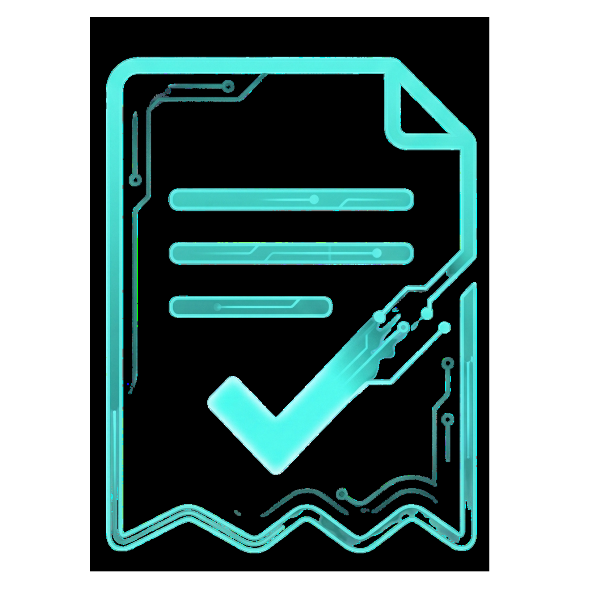

<div align="center">
  
  <h1>Autonom AI-baserad inkasso & fakturaindrivning</h1>
  <p><strong>Superclaim.io automatiserar hela din faktura-till-kassa-process med blixtsnabba AI-agenter.</strong></p>
  
  <p>
    <a href="#funktioner">Funktioner</a> •
    <a href="#arkitektur">Arkitektur</a> •
    <a href="#kom-igång">Kom igång</a> •
    <a href="#integrationer">Integrationer</a>
  </p>
</div>

---

## 🚀 Kassaflöde på autopilot

**Superclaim.io** är nästa generations SaaS-plattform för företag. Med Superclaim.io förvandlar du obetalda fakturor till kapital på banken – helt utan handpåläggning. 

Vår intelligenta AI-agent bevakar ditt affärssystem, skickar vänliga förvarningar, formella påminnelser via e-post och SMS, analyserar svar från gäldenärer och eskalerar vid behov till inkasso. Smidigt för dig, schysst mot kunden och stenhårt mot sena betalningar.

---

## ✨ Huvudfunktioner

- 🤖 **Blixtsnabb AI-Agent (Gemini)**: Vår agenter förstår kontext, läser inkommande svarvändningar och anpassar tonen för att bibehålla en god kundrelation samtidigt som de driver in skulden.
- 🔗 **Sömlös Fortnox-Integration**: `auto-import` hämtar förfallna och kommande fakturor automatiskt. Betalningar synkas i realtid och faktura-PDF:er hämtas med ett klick.
- 💬 **Omnichannel Kommunikation**: Nå dina kunder där de är. Agenten använder din egna domän via Google Workspace, Microsoft 365, e-post (AgentMail) eller SMS (46elks).
- 🔀 **Visuell Flow Builder (React Flow)**: Skapa skräddarsydda indrivningsflöden direkt i en vacker och intuitiv drag-and-drop-gränssnitt.
- 📊 **Dashboards i Världsklass**: Få stenkoll på utestående belopp, inkasserade medel (MoM-trender), och senaste händelser i den blixtsnabba och eleganta överblicken.
- 🔔 **Proaktiva Förvarningar**: Optimera ditt kassaflöde. Låt agenten skicka en vänlig påminnelse innan förfallodagen infaller.

---

## 🛠 Tech Stack

Projektet är byggt i en modern Turborepo-struktur och drivs av teknologier i världsklass.

| Kategori | Teknologi |
| :--- | :--- |
| **Ramverk** | Next.js 16 (App Router), React 19 |
| **Språk** | TypeScript |
| **Databas & Auth** | Supabase (PostgreSQL) |
| **AI Motor** | Google Gemini SDK (`@google/genai`) |
| **Styling** | Tailwind CSS v4, Radix UI, Lucide Icons |
| **Schemaläggning** | Upstash QStash & Vercel Cron |
| **Kommunikation**| AgentMail API, 46elks (SMS) |
| **Visuella flöden**| React Flow (`@xyflow/react`) |

---

## 🧩 Projektstruktur (Monorepo)

Vår flexibla infrastruktur gör systemet extremt skalbart och förberett för massiv tillväxt.

```text
Superclaim.io/
├── superclaim/
│   ├── apps/
│   │   ├── dashboard/   # Kundportalen - inställningar, claims, flödesbyggare (Next.js)
│   │   ├── frontend/    # Landningssida och marknadsföring (Next.js)
│   │   └── agent/       # Den autonoma indrivningsmotorn
│   └── supabase/        # Databasmigrationer och schema-definitioner
```

### Dashboard Core (Next.js App Router)
- **`/api/agent/run`**: Hjärtat i maskineriet. Trigger för QStash/Cron som startar indrivningskörningen för alla anslutna organisationer.
- **`/api/fortnox`**: Automagisk import av obetalda fordringar, kunddata och fakturafiler.
- **`/dashboard`**: KPIs, analytik, interaktiva tabeller och sparklines. 
- **`/dashboard/settings`**: Total kontroll. Hantera profiler, teammedlemmar, domäner och förvarningar.

---

## ⚙️ Kom igång

Börja bygga framtidens finansverktyg idag.

1. **Ställ in miljön**
   Skapa `apps/dashboard/.env.local` och fyll i:
   ```env
   # Supabase
   NEXT_PUBLIC_SUPABASE_URL=din_url
   NEXT_PUBLIC_SUPABASE_ANON_KEY=din_anon_key
   SUPABASE_SERVICE_ROLE_KEY=din_service_role
   
   # AI & Kommunikation
   GEMINI_API_KEY=AI...
   AGENTMAIL_API_KEY=am_...
   ELKS_API_USERNAME=u...
   ELKS_API_PASSWORD=...
   
   # Fortnox Integration
   FORTNOX_CLIENT_SECRET=...
   ```

2. **Installera och kör**
   ```bash
   cd superclaim
   npm install
   npm run dev
   ```
   Dashboarden snurrar nu på `http://localhost:3000` ✨

---

## 📈 Standard Indrivningsflöde

Indrivningen kan anpassas ned på detaljnivå per organisation:

```mermaid
graph TD
    A[Nytt ärende (Via Fortnox)] -->|3 Dagars fördröjning| B(Vänlig Påminnelse - Mail)
    B -->|7 Dagars fördröjning| C(Formell Påminnelse - Mail)
    C -->|Gäldenär svarar?| D{Analys (Gemini)}
    D -->|Ja - Positivt svar| E[Pausat för granskning]
    D -->|Nej - Inget svar| F(Påminnelse - SMS)
    F -->|8 Dagars fördröjning| G(Sista varningen)
    G -->|5 Dagars fördröjning| H((Eskaleras till Inkasso))
    
    classDef default fill:#122220,stroke:#00e5cc,stroke-width:1px,color:#fff;
    classDef start fill:#f5c842,stroke:#000,color:#000;
```

---

## 🔒 Säkerhet & Drift

- **Säkerhet**: Row-Level Security (RLS) via Supabase för att garantera att data stannar i rätt silos. Integrationer är skyddade med QStash-signaturer.
- **Drift**: Designad för Edge-deployment på **Vercel** för noll downtime och global prestanda.

<div align="center">
  <br/>
  <i>Byggt med precision för framtidens finanser.</i><br/>
  © 2026 Superclaim.io. Alla rättigheter förbehållna.
</div>
